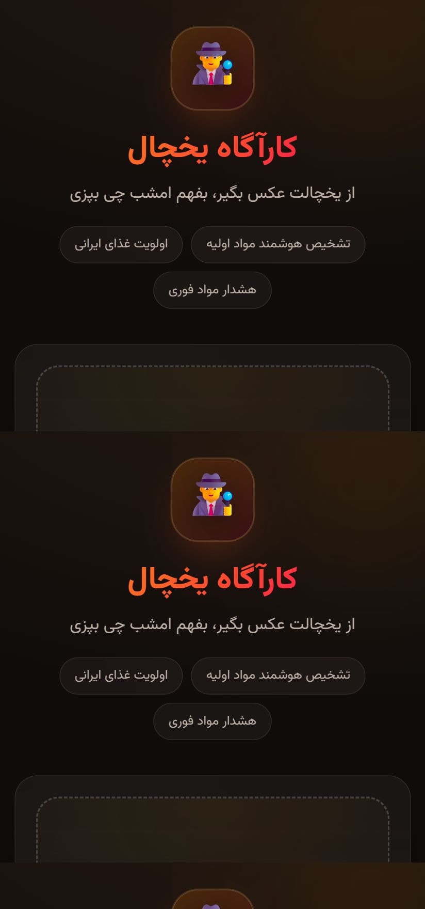
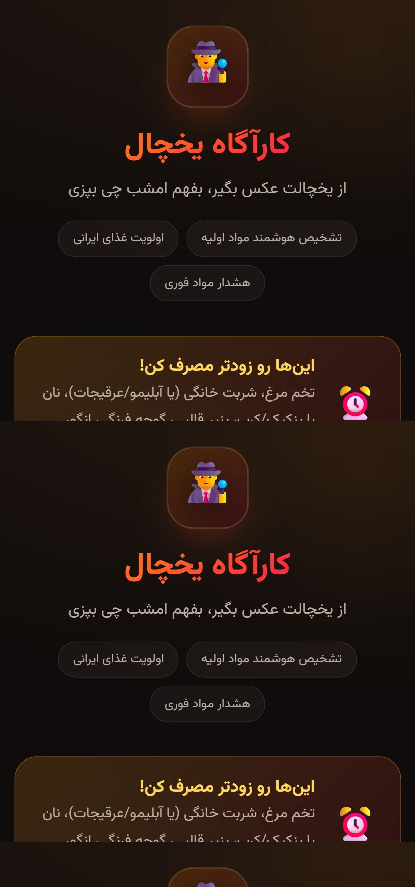
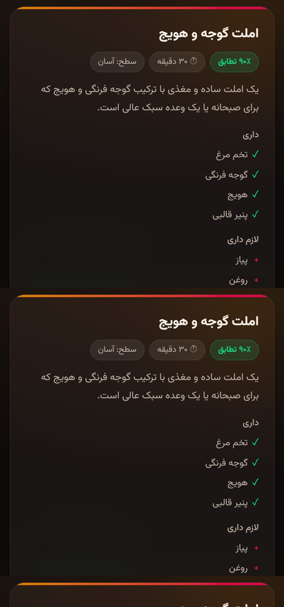
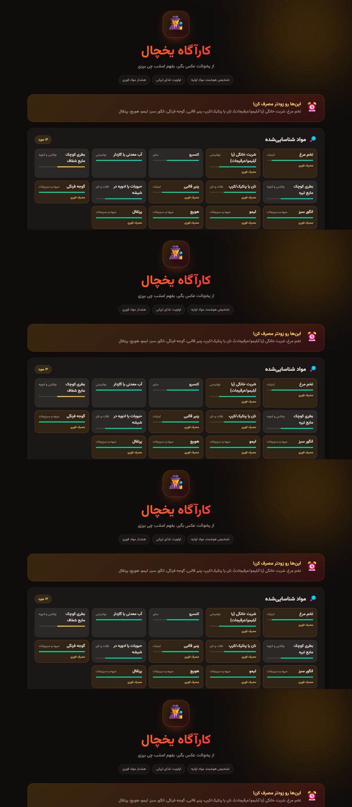

<div align="right">

# 🕵️ کارآگاه یخچال

**از یخچالت عکس بگیر، بفهم چی می‌تونی بپزی.**

عکس یخچال، فریزر یا کابینت آشپزخونه رو می‌فرستی؛ هوش مصنوعی مواد اولیه رو تشخیص می‌ده، هرکدوم رو از نظر تازگی رتبه‌بندی می‌کنه و چند غذا پیشنهاد می‌ده که با همون مواد موجود قابل پخت باشه — با اولویت غذاهای ایرانی.


</div>

---

<div align="right">

## ✨ امکانات

| | |
|---|---|
| 📷 **عکس مستقیم با دوربین** | روی گوشی، دوربین پشتی مستقیم باز می‌شه |
| 🧊 **تشخیص مواد اولیه** | نام، دسته‌بندی، وضعیت تازگی و درصد اطمینان |
| 🍲 **پیشنهاد غذا** | با اولویت غذای ایرانی، همراه مراحل پخت |
| ⏳ **هشدار مصرف فوری** | موادی که داره خراب می‌شه، اول معرفی می‌شن |
| 📱 **نصب به‌عنوان اپ (PWA)** | آیکون روی صفحه اصلی، اجرای تمام‌صفحه |
| 🇮🇷 **کاملاً فارسی و راست‌به‌چپ** | فونت وزیرمتن به‌صورت لوکال، بدون CDN |

## 🖼 نمای اپ

| صفحه اول (موبایل) | نتیجه تحلیل | کارت غذا |
|---|---|---|
|  |  |  |



</div>

<div align="right">

## 🚀 راه‌اندازی

نیازمندی: Node.js نسخه ۲۰ یا بالاتر.

```bash
git clone https://github.com/USERNAME/fridge-detective.git
cd fridge-detective
npm install
```

کلید Gemini رو از [Google AI Studio](https://aistudio.google.com/apikey) بگیر (رایگان) و بذارش در فایل `.env`:

```bash
cp .env.example .env
# بعد فایل .env رو باز کن و کلید رو بذار
```

```env
GEMINI_API_KEY=کلید_شما
```

اجرا:

```bash
npm start
```

بعد `http://localhost:3000` رو باز کن.

> سرور اول متغیر محیطی سیستم رو می‌خونه؛ اگر `GEMINI_API_KEY` رو در Environment Variables ویندوز تنظیم کرده باشی، به فایل `.env` نیازی نیست.

## 📱 اجرا روی گوشی

### راه اول: همون وای‌فای (سریع، موقت)

۱. یک بار فایل `allow-firewall.ps1` رو راست‌کلیک کن → Run with PowerShell (نیاز به دسترسی ادمین). پورت ۳۰۰۰ رو برای شبکه خصوصی باز می‌کنه.
۲. `start.bat` رو اجرا کن. آدرس‌های قابل استفاده رو چاپ می‌کنه.
۳. در مرورگر گوشی آدرس `http://192.168.x.x:3000` رو باز کن.

⚠️ **VPN مسیر شبکه محلی رو می‌گیره.** اگر آدرس باز نشد، اول VPN رو خاموش کن.

⚠️ در این حالت **دکمه نصب PWA ظاهر نمی‌شه**، چون مرورگرها نصب رو فقط روی `https` یا `localhost` اجازه می‌دن. برای نصب واقعی، بخش دیپلوی رو ببین.

### راه دوم: دیپلوی روی Railway (مستقل از کامپیوتر)

آدرس `https` دائمی می‌گیری، از هر جایی باز می‌شه و PWA هم قابل نصب می‌شه.

۱. کد رو به گیت‌هاب پوش کن.
۲. در [railway.com](https://railway.com) با گیت‌هاب لاگین کن → New Project → Deploy from GitHub repo.
۳. در تب **Variables** این‌ها رو اضافه کن:

   ```
   GEMINI_API_KEY = کلید_شما
   RATE_LIMIT_PER_HOUR = 30
   ```

   `PORT` رو دستی نگذار؛ Railway خودش تعیین می‌کنه.
۴. در **Settings → Networking → Generate Domain** آدرس بگیر.

از این به بعد هر `git push` خودش دیپلوی جدید می‌سازه.

### نصب به‌عنوان اپ

- **اندروید/کروم:** دکمه «نصب روی گوشی» پایین صفحه ظاهر می‌شه؛ یا منوی سه‌نقطه → Install app.
- **آی‌اواس/سافاری:** Share → Add to Home Screen.

بعد از نصب، پوسته اپ آفلاین هم باز می‌شه، ولی تحلیل عکس همیشه به اینترنت نیاز داره.

</div>

<div align="right">

## ⚙️ متغیرهای محیطی

| متغیر | پیش‌فرض | توضیح |
|---|---|---|
| `GEMINI_API_KEY` | — | **الزامی.** کلید Google AI Studio |
| `GEMINI_MODEL` | `gemini-2.5-flash` | اگر مدل خاصی می‌خوای |
| `PORT` | `3000` | پورت سرور |
| `RATE_LIMIT_PER_HOUR` | `30` | سقف درخواست هر IP در ساعت |

## 🏗 ساختار

```
fridge-detective/
├─ server.js                 سرور Express + فراخوانی Gemini
├─ public/
│  ├─ index.html             رابط کاربری فارسی (RTL)
│  ├─ styles.css             تم دارک، گلاسمورفیزم
│  ├─ app.js                 منطق سمت کلاینت
│  ├─ sw.js                  سرویس‌ورکر (کش آفلاین)
│  ├─ manifest.webmanifest   تنظیمات PWA
│  ├─ fonts/                 وزیرمتن (۴ وزن، لوکال)
│  └─ icons/                 آیکون‌های اپ
├─ start.bat                 اجرای سریع در ویندوز
├─ allow-firewall.ps1        باز کردن پورت برای گوشی
└─ railway.json              تنظیمات دیپلوی
```

### چطور کار می‌کنه

عکس‌ها با `multipart/form-data` به `POST /api/analyze` می‌رن، به base64 تبدیل و همراه یک پرامپت فارسی به Gemini فرستاده می‌شن. جواب به‌صورت JSON ساخت‌یافته برمی‌گرده و سمت کلاینت رندر می‌شه.

**زنجیره fallback مدل:** اگر مدلی در دسترس نبود یا سهمیه‌اش پر شد، خودکار بعدی امتحان می‌شه:
`gemini-2.5-flash` → `gemini-flash-latest` → `gemini-2.5-flash-lite` → `gemini-flash-lite-latest`

## 🔒 امنیت

- کلید API فقط سمت سرور می‌مونه و هرگز به مرورگر نمی‌ره. به همین دلیل اپ نمی‌تونه کاملاً بدون سرور کار کنه.
- فایل `.env` در `.gitignore` هست، پس کلید پوش نمی‌شه.
- **این سرور احراز هویت نداره.** با آدرس عمومی، هر کسی لینک رو داشته باشه می‌تونه از سهمیه Gemini تو مصرف کنه. محدودیت نرخ کمک می‌کنه ولی جای احراز هویت رو نمی‌گیره. لینک رو جای عمومی نگذار.

## ⚠️ سلب مسئولیت

تشخیص هوش مصنوعی همیشه دقیق نیست. **تاریخ انقضا و سالم بودن مواد غذایی رو خودت چک کن.** این اپ جایگزین قضاوت خودت نیست.

## 📄 مجوز

[MIT](LICENSE)

</div>
